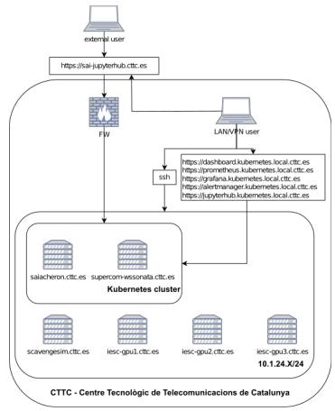

# 

Documentation for Kubernetes for development and data science purposes.
This repository serves as complementary configuration and documentation for Kubernetes cluster deployed at the [CTTC](https://www.cttc.cat/) for [Sustainable AI Research Unit](https://www.cttc.cat/sustainable-artificial-intelligence-sai/)

* Documentation: https://5uperpalo.github.io/devkubedoc/
* Work-In-Porgress configs: https://github.com/5uperpalo/devkubedoc/configs/

<figure class="image" align="center">
  
  <figcaption>Figure 1 Overview of SAI Kubernetes cluster</figcaption>
</figure>