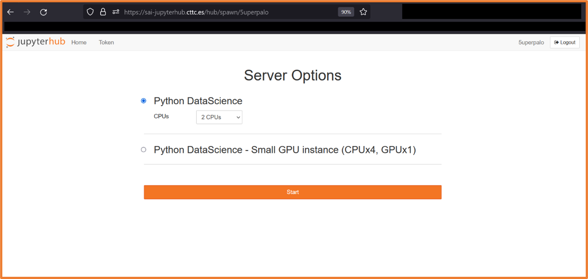

# Zero-to-Jupyterhub *[3 min read]*

The purpose of this document is to describe the possible ways of accessing SAI CTTC computational resources available through JupyterHub.

## Access

### Requesting Access
prerequisite: have a GitHub account

* contact Pavol Mulinka to add you to https://github.com/sai-cttc  group
* change your membership to public https://github.com/orgs/sai-cttc/people 

### External
#### WebGUI
  * login and test spawning a JupyterHub pod at https://sai-jupyterhub.cttc.es
<p align="center">
  
</p>
<p align="center">
  
</p>

### Internal(CTTC VPN)
#### WebGUI
* login and spawn a JupyterHub pod at any of the following
  * https://10.1.24.200
  * https://jupyterhub.sai.kubernetes.local 
  * https://sai-jupyterhub.cttc.es 
#### SSH
* generate token in JupyterHub GUI
<p align="center">
  
</p>
<p align="center">
  
</p>

* ssh using your Jupyterhub/GitHub username on port 22022 on either local IP address or local domain name jupyterhub.sai.kubernetes.local and use generated token as password: 
<p align="center">
  
</p>

#### VSCode remote ssh
Please follow the official VSCode instructions: https://code.visualstudio.com/docs/remote/ssh
* to generate a token, follow the instructions in the SSH section

#### VSCode-Server
Please follow the official VSCode-server instructions: https://github.com/coder/code-server 
* to generate a token, follow the instructions in the SSH section

#### Remote Jupyter server
Please follow this guide https://blog.jupyter.org/connect-to-a-jupyterhub-from-visual-studio-code-ed7ed3a31bcb .
* to generate a token, follow the instructions in the SSH section
Keep in mind that:
* you are looking at the local code
* you are running the code remotely
* you are opening files that are present on the remote NOT you local machine


## Known Issues 
### WebGUI - Internal(CTTC VPN)
* authentication through internal(local) IP address/URL results in OAuth error, this is most probably due to the following JupyterHub setting:
```
hub:
  config:
    GitHubOAuthenticator:
      oauth_callback_url: https://sai-jupyterhub.cttc.es/hub/oauth_callback
```
<p align="center">
  
</p>

### VSCode remote ssh 
* At the time of the writing this guide the vscode remote-ssh extension cause the spawned machine to hang, making it unresponsive. I had to restart the spawned machine in WebGUI to regain access to it.
SSH
* Putty is sending JupyterHub token symbols in different encoding than Linux/WSL terminal. Logs in jupyter-ssh pod show “scrambled” symbols while attempting to authenticate ssh session
* SSH in Linux/WSL terminal prepends and appends additional symbols to JupyterHub token. These symbols are removed in code running in jupyterhub-ssh pod.

### Remote Jupyter server
* At the time of writing this guide I lost this feature in VScode for unknown reason and I was unable to test it. I tried running VScode under WSL and Windows, both “normal” and development version.