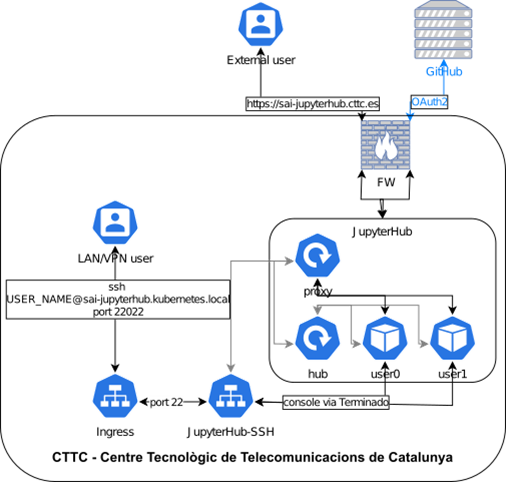
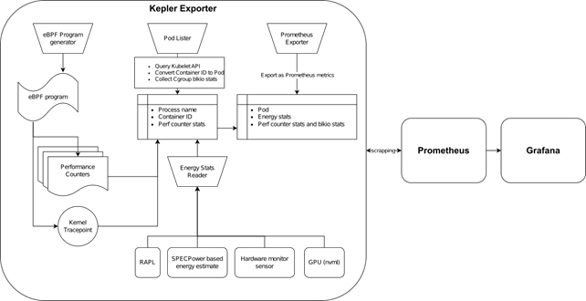

# Overview *[8 min read]*

<figure class="image" align="center">
  
  <figcaption>Figure 1 Overview of SAI Kubernetes cluster</figcaption>
</figure>

## Namespaces

Namespaces in Kubernetes provides a mechanism for separating groups of resources within a cluster. Usually, for many users spreaded across multiple teams. I found them also useful in a development, research-based environment. They provide a mechanism for logical separation and clearer, easier way of installing/uninstalling new services. For more information please see documentation on [namespaces](https://kubernetes.io/docs/concepts/overview/working-with-objects/namespaces/).

<figure class="image" align="center">
  
  <figcaption>Figure 2 Overview  of main cluster services</figcaption>
</figure>

### Description of namespaces used in SAI Kubernetes implementation

* kube-system - default Kubernetes administration namespace
* kube-public - default Kubernetes administration namespace
* kube-node-lease - default Kubernetes administration namespace
* sai - namespace reserved for JupyterHub, i.e. the initial(main) reason for Kubernetes implementation
* metallb-system – Microk8s load balancer [addon](https://microk8s.io/docs/addon-metallb) namespace, prerequisite for JupyterHub
* gpu-operator-resources - Microk8s NVIDIA GPU support [addon](https://microk8s.io/docs/addon-gpu) namespace to support spawning of GPU pods in JupyterHub
* nfs-server-provisioner - Microk8s NFS Ganesha Server and Provisioner [addon](https://microk8s.io/docs/addon-nfs) namespace; by default Microk8s uses [Hostpath Storage](https://microk8s.io/docs/addon-hostpath-storage) for provisioning of [Persistent Volumes](https://kubernetes.io/docs/concepts/storage/persistent-volumes/); this creates an issue if JupyterHub user spawns a pod on machine where he previously did not spawn a pod (e.g. he used CPU pod and now he wants to switch to GPU that is available on different physical machine); NFS solves this problem and was chosen among other network storage protocols due to its simplicity
* kepler – [Kubernetes Efficient Power Level Exporter (Kepler)](https://sustainable-computing.io/) namespace
* monitoring – [kube-prometheus-stack](https://github.com/prometheus-community/helm-charts/tree/main/charts/kube-prometheus-stack) namespace providing services of Prometheus, Grafana and Alert manager, see the related [documentation](https://github.com/prometheus-operator/kube-prometheus)
* ingress - Microk8s NGINX Ingress Controller [addon](https://microk8s.io/docs/addon-ingress) namespace for forwarding of HTTP, HTTPS, TCP and UDP traffic

## Services

Kubernetes defines services as objects, or methods, for exposing application(or functionality), running on one or more pods, through internal cluster network. Kubernetes Service API exposes functionality of pods through combination of service name and port to overcome issues of pods communication withi cluster using their cluster internal IP addresses. In this documentation we extend this definition to call the service a bundle of services that provides single functionality for the user e.g. JupyterHub, which combines both JupyterHub service and JupyterHub-ssh service. For more information about Kuberntes service please see the [documentation](https://kubernetes.io/docs/concepts/services-networking/service/).

### JupyterHub bundle

* Both JupyterHub and JupyterHub-ssh are deployed in a main sai namespace as initially the purpose of the cluster was to provide ONLY this functionality.
  * JupyterHub (Z[ero to JupyterHub doc](https://z2jh.jupyter.org/en/stable/jupyterhub/installation.html)): Zero to JupyterHub implementation provides easy implementation of JupyterHub in Kubernetes. The implementation is part of [Sustainability in Open Source Projects](https://sustainable-open-science-and-software.github.io/) study, i.e. it is inline with SAI goals to contribute and participate in sustainable AI/ML projects. The implementation documentation provide easy to understand and optimize guidelines using helm charts.
  * JupyterHub-ssh ([GitHub repo](https://github.com/yuvipanda/jupyterhub-ssh)): repository provides a way of access to spawned JupyterHub pods using SSH. The implementation can be extended to use SFTP between user machine and spawned JupyerHub pod. The SFTP extension requires additional configuration and troubleshooting. As the files can be easily uploaded/downloaded from spawned pods using Web GUI, I did not see a need to implement the extension.

<figure class="image" align="center">
  
  <figcaption>Figure 3 Communication with and within JupyterHub</figcaption>
</figure>

### Kubernetes energy consumption monitoring

Bundle of services implemented with focus on energy consumption monitoring of JupyterHub pods. As the implementation includes Prometheus and Grafana the usage of the services extends the initial idea.

<figure class="image" align="center">
  
  <figcaption>Figure 4 Kepler metrics export and visualization</figcaption>
</figure>

* [Kepler Exporter](https://github.com/sustainable-computing-io/kepler/blob/main/grafana-dashboards/Kepler-Exporter.json) ([helm chart](https://sustainable-computing.io/installation/kepler-helm/)): a part of Kubernetes-based Efficient Power Level Exporter – Model server bundle from [Sustainable Computing](https://github.com/sustainable-computing-io/kepler/blob/main/grafana-dashboards/Kepler-Exporter.json) group; it’s a metric exporter utilizing Prometheus to expose power consumption metrics that are visualized in [Kepler Grafana dashboard](https://github.com/sustainable-computing-io/kepler/blob/main/grafana-dashboards/Kepler-Exporter.json); the metrics usage could be extended by power consumption estimation or Kubernetes energy efficiency improvement by [PEAKS(Power Efficiency Aware Kubernetes Scheduler)](https://github.com/sustainable-computing-io/peaks) and [CLEVER(Container Level Energy-efficient VPA Recommender for Kubernetes)](https://github.com/sustainable-computing-io/clever)
* [Prometheus](https://prometheus.io/) ([helm chart](https://github.com/prometheus-operator/kube-prometheus)): a system and service monitoring system to collect metrics and raise alarms
* [Grafana](https://grafana.com/) ([helm chart](https://github.com/prometheus-operator/kube-prometheus)): query and visualization platform for monitoring, observation and alarm raising

### Administration

Group of services assuring communication to cluster services, their monitoring and provisioning; including new service deployments.

* DNS ([microk8s doc](https://microk8s.io/docs/addon-dns)): Service providing Domain Name System functionality for cluster pods
* NFS ([microk8s doc](https://microk8s.io/docs/addon-nfs)): Network File Server functionality for [Persistent Volume Claims](https://z2jh.jupyter.org/en/latest/jupyterhub/customizing/user-storage.html) (PVCs) of JupyterHub user pods enabling user to spawn a pod on any cluster node and have same storage content
* GPU support ([microk8s doc](https://microk8s.io/docs/addon-gpu)): NVIDIA GPU support on cluster nodes and pods to enabling spawing JupyterHub pods utilizing not only node CPUs but also GPUs
* Dashboard ([microk8s doc](https://microk8s.io/docs/addon-dashboard)): activity and resource monitoring of the cluster
* MetalLB ([microk8s doc](https://microk8s.io/docs/addon-metallb)): network load balancer that is a prerequisitive for Zero to JupyterHub implementation
* [Alert Manager](https://github.com/prometheus/alertmanager) ([helm chart](https://github.com/prometheus-operator/kube-prometheus)): part of Prometheus eco system used to raise system alarms
* Helm ([microk8s doc](https://microk8s.io/docs/addons)): Kubernetes package manager for easy installation, configuration and optimization of deployments
* Ingress ([microk8s doc](https://microk8s.io/docs/addon-ingress)): NGINX ingress controller serving as a Kubernetes reverse proxy, i.e. to forward HTPP/HTTPS and TCP/UDP traffic to correct cluster services

## Certificates
Administered by Centre de Serveis Informàtics (CSI) using [Sectigo](https://www.sectigo.com/) Certification Authority as CTTC has a contract with them.
Certificate is stored in Kubernetes secrets as `jupyterhub-tls`:
`sai kubectl get secret -n sai`

## Cluster administration

### Known Issues and solutions
* Adding new node to cluster (DNS & GPU)
  * Incorrect DNS search space and DNS was configured on one of the nodes resulting on issues with ingress services relying on correct DNS entries for FQDNS, see [commands](https://microk8s.io/docs/addon-dns) dns addon
  * GPU addon was not enabled in cluster resulting in issue with spawning JupyterHub pods that use GPUs, enabling GPU addon solved it
* Forwarding http/https traffic
  * The forwarding of traffic to correct services on correct ports had to be configured according microk8s ingress documentation to enable reaching of the cluster administration services from outside of the cluster

* Forwarding TCP traffic
  * Jupyterhub-ssh relies on usage of traefik for TCP port forwarding which is enabled in JupyterHub helm chart only if authohttps is enabled; autohttps uses letsencrypt to get certificate for https communication and for that the letsencrypt needs http port allowed on firewall; solution – manual certificate created by Sectigo(CTTC partner) and Ingress for TCP port forwarding of ssh traffic to jupyterhub-ssh service
* https certificate verification in jupyterhub-ssh solution
  * manual certificate for jupyterhub is for unknown reason ignored by code from jupyterhub-ssh that is running on the jupyterhub-ssh pod; the certificate is recognized when the code is tested after connecting to a running jupyterhub-ssh pod but it’s ignored by the code running on the background; solution – after many tries with changing the default user, using root user in the pod etc. I adjusted the code in repository to ignore certificate validation, created and published the docker image to [docker hub](https://hub.docker.com/repository/docker/5uperpalo/jupyterhub-ssh-ssl-disabled/general) and used it in the value.yaml configuration file for helm chart installation of jupyterhub-ssh
* issues and solution related to remote connection to JupyterHub – see “SAI CTTC JupyterHub User guide”
* Kubernetes dashboard only accessible with port forwarding and with generated token: I followed the official guide and created security risk by granding admin privileges to dashboard, see the [documentation](https://github.com/kubernetes/dashboard/blob/master/docs/user/access-control/README.md#admin-privileges)
* Jupyterhub ssl certificate: official documentation recommends autohttps using letsencrypt(creates a hole in security by enabling http from the internet) or manual cert; manual self-generated cert is an issue for other service and also prompts security alert for access the JupyterHub url; solution: use Sectigo certificate authority as it is a partner of CTTC
* Jupyterhub unable to spawn pods on newly added cluster node: by default the implementation uses hostpath for user storage, see [documentation](https://z2jh.jupyter.org/en/stable/jupyterhub/customizing/user-storage.html); this mean that all user data is stored on node where he spawned his first pod and can’t be moved to other nodes; solution: use NFS
* Define Jupyterhub pod configuration that can be used: solution by using Kubespawner in Jupyterhub configuration 
* JupyterHub pods being turned of after some time: disable cull option in the Jupyterhub configuration
* Robust way of user authentication to JupyterHub (i.e. not adjusting the JupyterHub configuration every time someone needs an access): solution by using [GitHubOAuthenticator](https://oauthenticator.readthedocs.io/en/latest/tutorials/provider-specific-setup/providers/github.html)

### Troubleshooting and other useful commands

#### Troubleshooting
* Local port forwarding to a specific service: e.g. forward traffic to localhost on port 3000 to a jupyterhub-ssh service on port 22 in sai namespace located in Kubernetes cluster (ip address or FQDN can be of any cluster node)
  * on a local machine
`ssh -L 3000:localhost:3000 pmulinka@10.1.24.201`
  * on node
`kubectl port-forward svc/jupyterhub-ssh 3000:22 -n sai`
* Pod status issues
`kubectl describe pod jupyterhub-ssh-7f58c4bc79-5lg5z`
* Connect to a pod
`kubectl exec jupyterhub-ssh-7f58c4bc79-5lg5z -n sai -it -- /bin/bash`
* Check pod logs
  * -f for continuous feed
`kubectl logs jupyterhub-ssh-7f58c4bc79-5lg5z -n sai -f`

#### Usefull commands
* apply configuration to Kubernetes cluster (e.g. apply changes to configuration of the service)
`kubectl apply -f config.yaml`
* show all running pods, services, deployments
`kubectl get pods -A`
`kubectl get services -A`
`kubectl get deployments -A`