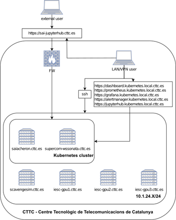

# DEVKUBEDOC *[2 min read]*

Documentation for Kubernetes for development and data science purposes.
This repository serves as complementary configuration and documentation for Kubernetes cluster deployed at the [CTTC](https://www.cttc.cat/) for [Sustainable AI Research Unit](https://www.cttc.cat/sustainable-artificial-intelligence-sai/).

Main purpose of this Kubernetes implementation is to deliver an experimental data science programming and testing environment to Sustainable AI Research Unit. An environment where all computational resources could be effectively shared among the Research Unit members and/or internal/external collaborators. An environment that is easy to extend by new servers financed by new grants. An environment that is easy to monitor and administer.

<figure class="image" align="center">
  
  <figcaption>Figure 1 Overview of SAI Kubernetes cluster</figcaption>
</figure>

Other advantages include:
1. use of Kubernetes infrastructure for simulation of Federated learning scenarios, e.g [EasyFL](https://github.com/EasyFL-AI/EasyFL) or [KubeFL](https://github.com/sortteam/kubeFL)
2. simulation of IIoT/IoT sensor deployment and analysis of the traffic between deployed pods(sensors), e.g. [IoTSimulator](https://github.com/VladimirAkopyan/IoTSimulator), [Kubeshark](https://kubeshark.co/)
3. MLOps, monitoring of models performance, ML pipelines etc. by easy helm chart deployment of e.g. [MLflow](https://github.com/cetic/helm-mlflow), [AirFlow](https://airflow.apache.org/docs/helm-chart/stable/index.html)
4. and many more, only sky is the limit...

I chose [Microk8s](https://microk8s.io/compare) Kubernetes implementation as it includes all necessary elements for JupyterHub, it is lightweitgh supports NFS, GPU, NGINX  and Ingress out of the box and is easy to administer, e.g see this [comparison](https://microk8s.io/compare).