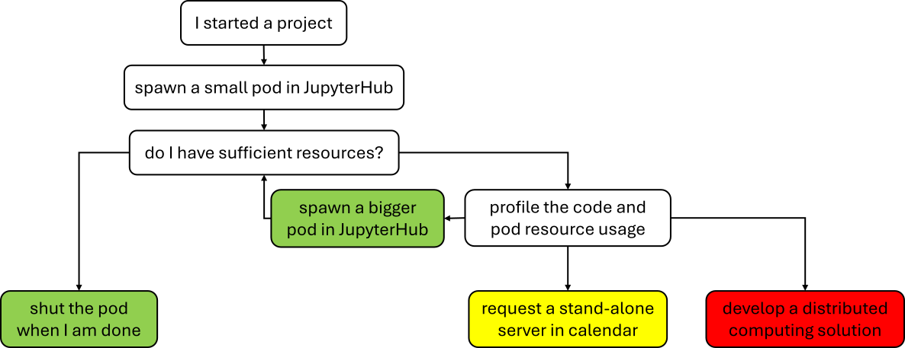
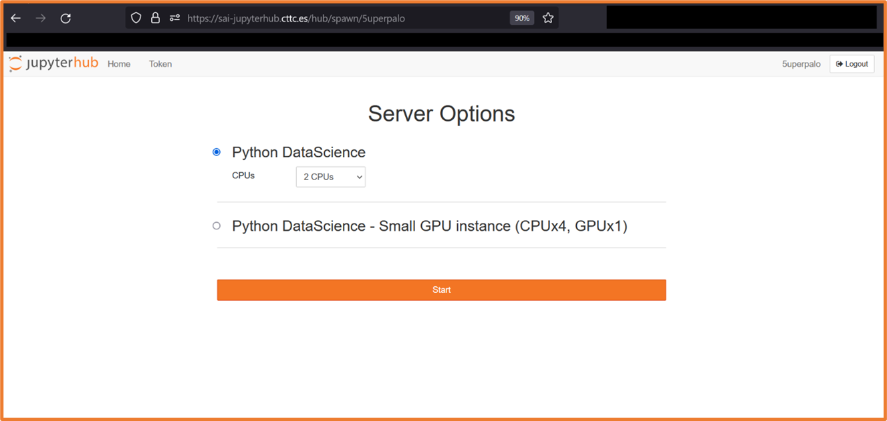
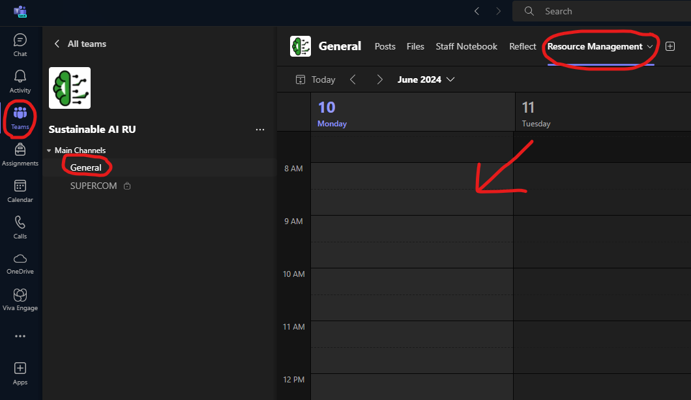

# Resource management *[2 min read]*

*"Develop small, run big"*

<figure class="image" align="center">
  
  <figcaption>Resource usage decision tree</figcaption>
</figure>

<figure class="image" align="center">
  
  
  <figcaption>JupyterHub | Teams calendar</figcaption>
</figure>

## Basic rules to follow
* if you are using helpfull microservice, deploy it as separate pod and share the usage with team, e.g. Carla or [SUCCESS6G services](https://github.com/5uperpalo/success6g-edge/blob/main/kubernetes_services.MD)
* do EDA(Exploratory Data Analysis), develop, debug, and troubleshoot code on small JupyterHub pod or on your local machine
* run script on larger pod
* if absolutely necessary run the code on standalone server
* if ultra-super-duper-absolutely necessary develop solution using SLURM or SLURM on Kubernetes

## Step-by-step

Please follow these simple rules to avoid misuse of the SAI Research Unit computational resources:
1. spawn a small pod that is sufficient to process the data your are using
	* i.e. depending on the dataset size do a best guess and eventually go bigger
2. profile your code and pod resource usage
3. spawn a larger pod if needed
4. estimate a time and requirements and request a standalone server by putting a note into shared callendar in Teams - **MANDATORY**
	* make an ssh message - **OPTIONAL** (e.g. when you are chasing deadline and cant afford any mishaps)
5. **[EXTREME]** - develop a solution using multiple machines using SLURM, SLURM on Kubernetes, or other solution; and consult it with team

## GPU inside JupyterHub pod

To get the GPU running in a pod install a proper driver:
```
sudo apt-get update
sudo apt install nvidia-utils-535
```

For Code Profiling please see [code_profiling.md](code_profiling.md).
